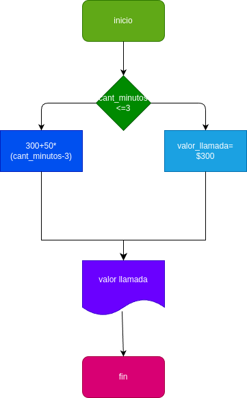

# Condicionales_1

condicionales #1

## Costo de una llamada telefónica

ingresar el tiempo de duracion de una llama telefónica y determinar la cantidad a pagar, de acuerdo con lo siguiente:
- Toda llamada que tenga una duracion de de 3 minutos o menos tiene un costo de $300 pesos
- cada minuto adicional cuesta $50 pesos
si la cantidad de minutos es =<3

# analisis

## input

### variable de entrada
cantidad_minutos: donde ponemos la cantidad de minutos para el pago de la llamada

### prossesing
cantidad_minutos >=3=$300

cantidad_minutos <3= 300+50*(cantidad_minutos-3)
# diseño

# construccion
